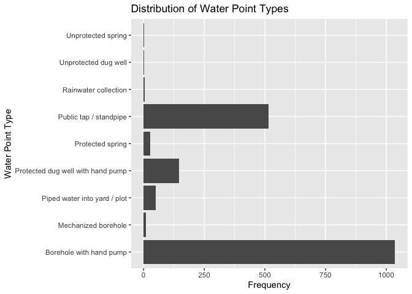

<!-- README.md is generated from README.Rmd. Please edit that file -->

# rwpfunctionality

<!-- badges: start -->
<!-- badges: end -->

This package offers users comprehensive documentation on surveys
conducted to assess water point functionality and management committees.
These surveys were carried out across nine countries in both sub-Saharan
Africa and South Asia.

## Installation

You can install the development version of rwpfunctionality from
[GitHub](https://github.com/) with:

``` r
# install.packages("devtools")
devtools::install_github("openwashdata/rwpfunctionality")
```

Alternatively, you can download the individual datasets as a CSV or XLSX
file from the table below.

| dataset          | CSV                                                                                                         | XLSX                                                                                                          |
|:-----------------|:------------------------------------------------------------------------------------------------------------|:--------------------------------------------------------------------------------------------------------------|
| rwpfunctionality | [Download CSV](https://github.com/openwashdata/rwpfunctionality/raw/main/inst/extdata/rwpfunctionality.csv) | [Download XLSX](https://github.com/openwashdata/rwpfunctionality/raw/main/inst/extdata/rwpfunctionality.xlsx) |

## Project goal

Sustained functionality of rural water systems is a global challenge.
Addressing premature failures and unreliable performance of water points
is crucial to achieve the 2030 Sustainable Development Goal (SDG) 6,
which calls for universal and equitable access to safe and affordable
drinking water for all (WHO, 2017). As of 2020, 771 million people
lacked a basic water service (WHO & UNICEF, 2021). Yet even for those
with water services, unreliable water infrastructure that provides
intermittent supply, or is broken down or abandoned, contributes to
unsustainable and unsafe water access worldwide (Allaire et al., 2018;
Burt et al., 2018; Klug et al., 2018; Valcourt et al., 2020).

## Data

The data set includes observations of water point functionality and
management committee questionnaires.

The package provides access to one single data set.

``` r
library(rwpfunctionality)
```

The `rwpfunctionality` data set has 52 variables and 1793 observations.
For an overview of the variable names, see the following table.

``` r
rwpfunctionality
```

| variable_name            | variable_type | description                                                                                                                                                                                                                                                                                                                                                                                                                                                                                                                                                                                                       |
|:-------------------------|:--------------|:------------------------------------------------------------------------------------------------------------------------------------------------------------------------------------------------------------------------------------------------------------------------------------------------------------------------------------------------------------------------------------------------------------------------------------------------------------------------------------------------------------------------------------------------------------------------------------------------------------------|
| country                  | character     | Name of the country                                                                                                                                                                                                                                                                                                                                                                                                                                                                                                                                                                                               |
| admin1                   | character     | Administrative unit 1                                                                                                                                                                                                                                                                                                                                                                                                                                                                                                                                                                                             |
| admin2                   | character     | Administrative unit 2                                                                                                                                                                                                                                                                                                                                                                                                                                                                                                                                                                                             |
| admin3                   | character     | Administrative unit 3                                                                                                                                                                                                                                                                                                                                                                                                                                                                                                                                                                                             |
| instance_wp              | character     | Survey ID                                                                                                                                                                                                                                                                                                                                                                                                                                                                                                                                                                                                         |
| subdate_wp               | character     | Submission date                                                                                                                                                                                                                                                                                                                                                                                                                                                                                                                                                                                                   |
| latitude_wp              | double        | Latitude                                                                                                                                                                                                                                                                                                                                                                                                                                                                                                                                                                                                          |
| longitude_wp             | double        | Longitude                                                                                                                                                                                                                                                                                                                                                                                                                                                                                                                                                                                                         |
| elevation_wp             | double        | Elevation                                                                                                                                                                                                                                                                                                                                                                                                                                                                                                                                                                                                         |
| commid_wp                | character     | Community ID                                                                                                                                                                                                                                                                                                                                                                                                                                                                                                                                                                                                      |
| dataorg_wp               | character     | Code for country program                                                                                                                                                                                                                                                                                                                                                                                                                                                                                                                                                                                          |
| timepoint_wp             | character     | Data collection time point                                                                                                                                                                                                                                                                                                                                                                                                                                                                                                                                                                                        |
| cwfunded_wp              | character     | Charity water-funded water point                                                                                                                                                                                                                                                                                                                                                                                                                                                                                                                                                                                  |
| cwid                     | character     | Charity water point ID                                                                                                                                                                                                                                                                                                                                                                                                                                                                                                                                                                                            |
| wptype                   | character     | Water point type                                                                                                                                                                                                                                                                                                                                                                                                                                                                                                                                                                                                  |
| pumptype                 | character     | Pump type                                                                                                                                                                                                                                                                                                                                                                                                                                                                                                                                                                                                         |
| drillmethod              | character     | Methodology used to dig the well or borehole                                                                                                                                                                                                                                                                                                                                                                                                                                                                                                                                                                      |
| piped_source             | character     | Source of piped water                                                                                                                                                                                                                                                                                                                                                                                                                                                                                                                                                                                             |
| piped_pump               | character     | Infrastructure through which water travels from the source to the storage tank                                                                                                                                                                                                                                                                                                                                                                                                                                                                                                                                    |
| rehabyn                  | character     | This water point has undergone rehabilitation with the assistance of an outside organization since its construction                                                                                                                                                                                                                                                                                                                                                                                                                                                                                               |
| qtyhh_wp                 | double        | Number of households served by this water point, either presently or during its last operational period                                                                                                                                                                                                                                                                                                                                                                                                                                                                                                           |
| whomanage_wp             | character     | Primarily responsible for managing this water point                                                                                                                                                                                                                                                                                                                                                                                                                                                                                                                                                               |
| wp_age                   | double        | Years between the reported construction year of the water point and the year of the survey                                                                                                                                                                                                                                                                                                                                                                                                                                                                                                                        |
| rehab_age                | double        | Years between the reported most recent rehabilitation year of the water point and the year of the survey                                                                                                                                                                                                                                                                                                                                                                                                                                                                                                          |
| qtypeople_wp             | double        | Number of people served by this water point, either now or the last time it was working                                                                                                                                                                                                                                                                                                                                                                                                                                                                                                                           |
| wateravailable           | character     | Water availability from this water point                                                                                                                                                                                                                                                                                                                                                                                                                                                                                                                                                                          |
| functional3              | character     | Functionality rating for water point: ‘Abandoned or not functional’ means no water available \>1 year or no water available today OR (water available, but insufficient quantity AND downtime reported in prior 2 weeks), ‘Partially functional’ means water is available with sufficient quantity - 20L in 5 min - but downtime reported in prior 2 weeks or water is available, but insufficient quantity - 20L in 5 min - and no downtime reported in prior 2 weeks and ‘Functional’ means water is available, sufficient quantity is available - 20L in 5 minutes - and no downtime reported in prior 2 weeks |
| whynowatertoday_wp       | character     | Reason for unavailability of water from this water point today                                                                                                                                                                                                                                                                                                                                                                                                                                                                                                                                                    |
| whynowatertoday_wp_other | character     | Other reason for water not being available today                                                                                                                                                                                                                                                                                                                                                                                                                                                                                                                                                                  |
| minutesfill20l           | double        | Time required to fill the 20 liters container                                                                                                                                                                                                                                                                                                                                                                                                                                                                                                                                                                     |
| brokendays_wp            | double        | Number of days it took to repair water the point last time it broke down                                                                                                                                                                                                                                                                                                                                                                                                                                                                                                                                          |
| qtymonthsnowater_wp      | double        | Number of months in the past year when water was not available from this water point because it was dry                                                                                                                                                                                                                                                                                                                                                                                                                                                                                                           |
| downtime2weeks           | character     | Water has not been available from this water point for a full day or more due to breakdown, seasonal dryness, or lack of fuel or electricity in the past two weeks                                                                                                                                                                                                                                                                                                                                                                                                                                                |
| lockedfullday_wp         | character     | Service has been turned off or the water point has been locked in the past year by the management for reasons other than breakdowns                                                                                                                                                                                                                                                                                                                                                                                                                                                                               |
| pumpstrokes              | double        | Number of pump strokes needed until water begins to flow                                                                                                                                                                                                                                                                                                                                                                                                                                                                                                                                                          |
| photo_wp                 | character     | Photograph of the water point                                                                                                                                                                                                                                                                                                                                                                                                                                                                                                                                                                                     |
| grant_number_wp          | double        | Water grant number                                                                                                                                                                                                                                                                                                                                                                                                                                                                                                                                                                                                |
| wc_present_wp            | character     | Existence of water committee in this community that manages water points used for drinking                                                                                                                                                                                                                                                                                                                                                                                                                                                                                                                        |
| paytocollect_wp          | character     | Obligation for people to contribute money to collect water in this community                                                                                                                                                                                                                                                                                                                                                                                                                                                                                                                                      |
| balance_any_dollars_wp   | double        | Amount of money saved by the committee (converted to USD)                                                                                                                                                                                                                                                                                                                                                                                                                                                                                                                                                         |
| improved_wponly_wp       | double        | Number of improved water point types used in the community                                                                                                                                                                                                                                                                                                                                                                                                                                                                                                                                                        |
| qtyhh_c_wp               | double        | Number of households in this community                                                                                                                                                                                                                                                                                                                                                                                                                                                                                                                                                                            |
| wc_admin_index_wp        | character     | Administrative index for water committee: ‘Inadequate’ means WC hasn’t met in \>6 months, ‘Minimum’ means WC has reported to have met within 6 months, ‘Moderate’ means WC has reported to have met within 6 months, and has at least 1/3 female members and ‘Advanced’ means WC has reported to have met within 6 months, has at least 1/3 female members, AND has record of a meeting within previous 6 months                                                                                                                                                                                                  |
| wc_finance_index_wp      | character     | Finance index for water committee: ‘Inadequate’ means WC does not collect fees, ‘Minimum’ means WC reports a fee collection system, ‘Moderate’ means WC reports collecting fees and reports having savings and ‘Advanced’ means WC reports collecting fees and reports having savings, can demonstrate a fee collection or balance, and reports that money is kept in a cash box, bank account, mobile money, or borehole banking                                                                                                                                                                                 |
| wc_maint_index_wp        | character     | Maintenance index for water committee: ‘Inadequate’ means WC cannot identify a person for water point maintenance, ‘Minimum’ means WC can identify a person for water point maintenance , ‘Moderate’ means WC can identify a repair person and that person has had training. Plus, the community has access to tools and spare parts and ‘Advanced’ means WC can identify a repair person and that person has had training. Plus, the community has access to tools and spare parts AND reported that someone has performed preventive maintenence within the past year                                           |
| wc_mgmt_index_wp         | character     | Overall management index for water committee: ‘Inadequate’ means WC is inadequate in any of the above indices, ‘Minimum’ means WC meets minimum level in all above indices \[“Operational” Committee\], ‘Moderate’ means WC meets moderate level in all above indices and ‘Advanced’ means WC meets moderate level in all above indices AND advanced level in at least one of the above                                                                                                                                                                                                                           |
| wc_savings_wp            | double        | Existence of money saved from water committee to repair water points                                                                                                                                                                                                                                                                                                                                                                                                                                                                                                                                              |
| wpqty_wp                 | double        | Number of drinking water points in this community, working or not                                                                                                                                                                                                                                                                                                                                                                                                                                                                                                                                                 |
| pop_1000                 | double        | Population aggregated for a 1-km radius around the water point (data from from <https://www.worldpop.org/>)                                                                                                                                                                                                                                                                                                                                                                                                                                                                                                       |
| annual_rain              | double        | Average annual mm of precipitation for administrative unit 2 (average from 1991-2020, from <https://climateknowledgeportal.worldbank.org/>)                                                                                                                                                                                                                                                                                                                                                                                                                                                                       |
| season                   | character     | Season of data collection, according to hostorical rainall amounts (from <https://climateknowledgeportal.worldbank.org/>)                                                                                                                                                                                                                                                                                                                                                                                                                                                                                         |

## Examples

### Pie Chart of Water Points Functionality

What are the statuses of the water points? Are they functional?

``` r
library(dplyr)
library(ggplot2)

# Define custom colors
custom_colors <- c("lightblue", "orange", "purple")

# Create the pie chart
rwpfunctionality |>
  count(functional3) |> 
  ggplot(aes(x = "", y = n, fill = functional3)) +
  geom_bar(stat = "identity") +
  coord_polar("y", start = 0) +
  scale_fill_manual(values = custom_colors) +  # Set custom colors
  labs(title = "Functionality rating for water points", fill = NULL,
       x = "",  # Empty x-axis label
       y = "Count") +  # y-axis label
  scale_fill_manual(labels = c("Functional", "Partially functional", "Abandoned or not functional"),
                    values = custom_colors)  # Custom legend labels
```


Based on this pie chart, it could be interesting to redefine the
category “Partially functional” to gain insights and precision on this
aspect of the data. However, we still clearly see that only a small part
of the water points are functional.

### Water Point Types

What are the different types of water points?

``` r
# Create a horizontal bar plot of water point types
ggplot(rwpfunctionality, aes(x = wptype)) +
  geom_bar() +
  labs(title = "Distribution of Water Points Types",
       x = "Water Point Type",
       y = "Frequency") +
  coord_flip()  # Flip coordinates to make it horizontal
```



## License

Data are available as
[CC-BY](https://github.com/openwashdata/rwpfunctionality/LICENSE.md).

## Citation

To cite this package, please use:

``` r
citation("rwpfunctionality")
#> To cite package 'rwpfunctionality' in publications use:
#> 
#>   Götschmann M (2024). _rwpfunctionality: Water point functionality
#>   assessment in nine sub-Saharan Africa and South Asia countries_. R
#>   package version 0.0.0.9000.
#> 
#> A BibTeX entry for LaTeX users is
#> 
#>   @Manual{,
#>     title = {rwpfunctionality: Water point functionality assessment in nine sub-Saharan Africa
#> and South Asia countries},
#>     author = {Margaux Götschmann},
#>     year = {2024},
#>     note = {R package version 0.0.0.9000},
#>   }
```
