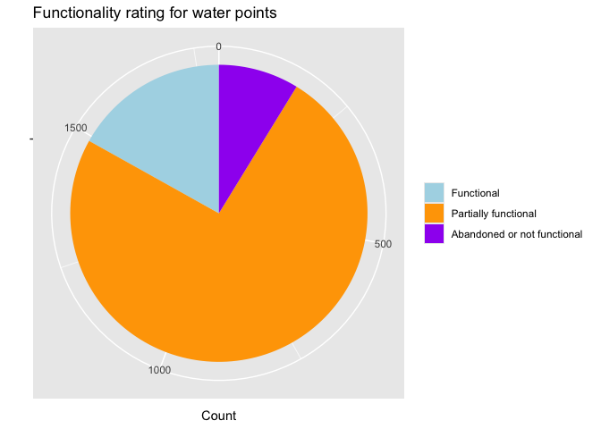

<!-- README.md is generated from README.Rmd. Please edit that file -->

# rwpfunctionality

<!-- badges: start -->
<!-- badges: end -->

This package offers users comprehensive documentation on surveys
conducted to assess water point functionality and management committees.
These surveys were carried out across nine countries in both sub-Saharan
Africa and South Asia. The data was published alongside the article
“Rural water point functionality estimates and associations: evidence
from nine countries in sub-Saharan Africa and South Asia” (Murray et al.
2024).

## Installation

You can install the development version of rwpfunctionality from
[GitHub](https://github.com/) with:

``` r
# install.packages("devtools")
devtools::install_github("openwashdata/rwpfunctionality")
```

Alternatively, you can download the dataset as a CSV or XLSX file from
the table below.

| dataset          | CSV                                                                                                         | XLSX                                                                                                          |
|:-----------------|:------------------------------------------------------------------------------------------------------------|:--------------------------------------------------------------------------------------------------------------|
| rwpfunctionality | [Download CSV](https://github.com/openwashdata/rwpfunctionality/raw/main/inst/extdata/rwpfunctionality.csv) | [Download XLSX](https://github.com/openwashdata/rwpfunctionality/raw/main/inst/extdata/rwpfunctionality.xlsx) |

## Project goal

Sustained functionality of rural water systems is a global challenge.
Addressing premature failures and unreliable performance of water points
is crucial to achieve the 2030 Sustainable Development Goal (SDG) 6,
which calls for universal and equitable access to safe and affordable
drinking water for all (“Safely Managed Drinking-Water” 2017). As of
2020, 771 million people lacked a basic water service (“Progress on
Household Drinking Water, Sanitation and Hygiene, 2000-2020: Five Years
into the SDGs” 2021). Yet even for those with water services, unreliable
water infrastructure that provides intermittent supply, or is broken
down or abandoned, contributes to unsustainable and unsafe water access
worldwide (Allaire, Wu, and Lall 2018; Burt et al. 2018; Klug, Shields,
and Bartram 2018; Valcourt et al. 2020).

## Data

The dataset includes observations of water point functionality and
management committee questionnaires. Displayed on the map are the
locations of the water points.


The package provides access to one single dataset.

``` r
library(rwpfunctionality)
```

The `rwpfunctionality` dataset has 52 variables and 1793 observations.
For an overview of the variable names, see the following table.

``` r
rwpfunctionality
```

<div style="border: 1px solid #ddd; padding: 0px; overflow-y: scroll; height:400px; ">

<table class="table" style="margin-left: auto; margin-right: auto;">
<thead>
<tr>
<th style="text-align:left;position: sticky; top:0; background-color: #FFFFFF;">
variable_name
</th>
<th style="text-align:left;position: sticky; top:0; background-color: #FFFFFF;">
variable_type
</th>
<th style="text-align:left;position: sticky; top:0; background-color: #FFFFFF;">
description
</th>
</tr>
</thead>
<tbody>
<tr>
<td style="text-align:left;">
country
</td>
<td style="text-align:left;">
character
</td>
<td style="text-align:left;">
Name of the country
</td>
</tr>
<tr>
<td style="text-align:left;">
admin1
</td>
<td style="text-align:left;">
character
</td>
<td style="text-align:left;">
Administrative unit 1
</td>
</tr>
<tr>
<td style="text-align:left;">
admin2
</td>
<td style="text-align:left;">
character
</td>
<td style="text-align:left;">
Administrative unit 2
</td>
</tr>
<tr>
<td style="text-align:left;">
admin3
</td>
<td style="text-align:left;">
character
</td>
<td style="text-align:left;">
Administrative unit 3
</td>
</tr>
<tr>
<td style="text-align:left;">
instance_wp
</td>
<td style="text-align:left;">
character
</td>
<td style="text-align:left;">
Survey ID
</td>
</tr>
<tr>
<td style="text-align:left;">
subdate_wp
</td>
<td style="text-align:left;">
character
</td>
<td style="text-align:left;">
Submission date
</td>
</tr>
<tr>
<td style="text-align:left;">
latitude_wp
</td>
<td style="text-align:left;">
double
</td>
<td style="text-align:left;">
Latitude
</td>
</tr>
<tr>
<td style="text-align:left;">
longitude_wp
</td>
<td style="text-align:left;">
double
</td>
<td style="text-align:left;">
Longitude
</td>
</tr>
<tr>
<td style="text-align:left;">
elevation_wp
</td>
<td style="text-align:left;">
double
</td>
<td style="text-align:left;">
Elevation
</td>
</tr>
<tr>
<td style="text-align:left;">
commid_wp
</td>
<td style="text-align:left;">
character
</td>
<td style="text-align:left;">
Community ID
</td>
</tr>
<tr>
<td style="text-align:left;">
dataorg_wp
</td>
<td style="text-align:left;">
character
</td>
<td style="text-align:left;">
Code for country program
</td>
</tr>
<tr>
<td style="text-align:left;">
timepoint_wp
</td>
<td style="text-align:left;">
character
</td>
<td style="text-align:left;">
Data collection time point
</td>
</tr>
<tr>
<td style="text-align:left;">
cwfunded_wp
</td>
<td style="text-align:left;">
character
</td>
<td style="text-align:left;">
Charity water-funded water point
</td>
</tr>
<tr>
<td style="text-align:left;">
cwid
</td>
<td style="text-align:left;">
character
</td>
<td style="text-align:left;">
Charity water point ID
</td>
</tr>
<tr>
<td style="text-align:left;">
wptype
</td>
<td style="text-align:left;">
character
</td>
<td style="text-align:left;">
Water point type
</td>
</tr>
<tr>
<td style="text-align:left;">
pumptype
</td>
<td style="text-align:left;">
character
</td>
<td style="text-align:left;">
Pump type
</td>
</tr>
<tr>
<td style="text-align:left;">
drillmethod
</td>
<td style="text-align:left;">
character
</td>
<td style="text-align:left;">
Methodology used to dig the well or borehole
</td>
</tr>
<tr>
<td style="text-align:left;">
piped_source
</td>
<td style="text-align:left;">
character
</td>
<td style="text-align:left;">
Source of piped water
</td>
</tr>
<tr>
<td style="text-align:left;">
piped_pump
</td>
<td style="text-align:left;">
character
</td>
<td style="text-align:left;">
Infrastructure through which water travels from the source to the
storage tank
</td>
</tr>
<tr>
<td style="text-align:left;">
rehabyn
</td>
<td style="text-align:left;">
character
</td>
<td style="text-align:left;">
This water point has undergone rehabilitation with the assistance of an
outside organization since its construction
</td>
</tr>
<tr>
<td style="text-align:left;">
qtyhh_wp
</td>
<td style="text-align:left;">
double
</td>
<td style="text-align:left;">
Number of households served by this water point, either presently or
during its last operational period
</td>
</tr>
<tr>
<td style="text-align:left;">
whomanage_wp
</td>
<td style="text-align:left;">
character
</td>
<td style="text-align:left;">
Primarily responsible for managing this water point
</td>
</tr>
<tr>
<td style="text-align:left;">
wp_age
</td>
<td style="text-align:left;">
double
</td>
<td style="text-align:left;">
Years between the reported construction year of the water point and the
year of the survey
</td>
</tr>
<tr>
<td style="text-align:left;">
rehab_age
</td>
<td style="text-align:left;">
double
</td>
<td style="text-align:left;">
Years between the reported most recent rehabilitation year of the water
point and the year of the survey
</td>
</tr>
<tr>
<td style="text-align:left;">
qtypeople_wp
</td>
<td style="text-align:left;">
double
</td>
<td style="text-align:left;">
Number of people served by this water point, either now or the last time
it was working
</td>
</tr>
<tr>
<td style="text-align:left;">
wateravailable
</td>
<td style="text-align:left;">
character
</td>
<td style="text-align:left;">
Water availability from this water point
</td>
</tr>
<tr>
<td style="text-align:left;">
functional3
</td>
<td style="text-align:left;">
character
</td>
<td style="text-align:left;">
Functionality rating for water point: ‘Abandoned or not functional’
means no water available \>1 year or no water available today OR (water
available, but insufficient quantity AND downtime reported in prior 2
weeks), ‘Partially functional’ means water is available with sufficient
quantity - 20L in 5 min - but downtime reported in prior 2 weeks or
water is available, but insufficient quantity - 20L in 5 min - and no
downtime reported in prior 2 weeks and ‘Functional’ means water is
available, sufficient quantity is available - 20L in 5 minutes - and no
downtime reported in prior 2 weeks
</td>
</tr>
<tr>
<td style="text-align:left;">
whynowatertoday_wp
</td>
<td style="text-align:left;">
character
</td>
<td style="text-align:left;">
Reason for unavailability of water from this water point today
</td>
</tr>
<tr>
<td style="text-align:left;">
whynowatertoday_wp_other
</td>
<td style="text-align:left;">
character
</td>
<td style="text-align:left;">
Other reason for water not being available today
</td>
</tr>
<tr>
<td style="text-align:left;">
minutesfill20l
</td>
<td style="text-align:left;">
double
</td>
<td style="text-align:left;">
Time required to fill the 20 liters container
</td>
</tr>
<tr>
<td style="text-align:left;">
brokendays_wp
</td>
<td style="text-align:left;">
double
</td>
<td style="text-align:left;">
Number of days it took to repair water the point last time it broke down
</td>
</tr>
<tr>
<td style="text-align:left;">
qtymonthsnowater_wp
</td>
<td style="text-align:left;">
double
</td>
<td style="text-align:left;">
Number of months in the past year when water was not available from this
water point because it was dry
</td>
</tr>
<tr>
<td style="text-align:left;">
downtime2weeks
</td>
<td style="text-align:left;">
character
</td>
<td style="text-align:left;">
Water has not been available from this water point for a full day or
more due to breakdown, seasonal dryness, or lack of fuel or electricity
in the past two weeks
</td>
</tr>
<tr>
<td style="text-align:left;">
lockedfullday_wp
</td>
<td style="text-align:left;">
character
</td>
<td style="text-align:left;">
Service has been turned off or the water point has been locked in the
past year by the management for reasons other than breakdowns
</td>
</tr>
<tr>
<td style="text-align:left;">
pumpstrokes
</td>
<td style="text-align:left;">
double
</td>
<td style="text-align:left;">
Number of pump strokes needed until water begins to flow
</td>
</tr>
<tr>
<td style="text-align:left;">
photo_wp
</td>
<td style="text-align:left;">
character
</td>
<td style="text-align:left;">
Photograph of the water point
</td>
</tr>
<tr>
<td style="text-align:left;">
grant_number_wp
</td>
<td style="text-align:left;">
double
</td>
<td style="text-align:left;">
Water grant number
</td>
</tr>
<tr>
<td style="text-align:left;">
wc_present_wp
</td>
<td style="text-align:left;">
character
</td>
<td style="text-align:left;">
Existence of water committee in this community that manages water points
used for drinking
</td>
</tr>
<tr>
<td style="text-align:left;">
paytocollect_wp
</td>
<td style="text-align:left;">
character
</td>
<td style="text-align:left;">
Obligation for people to contribute money to collect water in this
community
</td>
</tr>
<tr>
<td style="text-align:left;">
balance_any_dollars_wp
</td>
<td style="text-align:left;">
double
</td>
<td style="text-align:left;">
Amount of money saved by the committee (converted to USD)
</td>
</tr>
<tr>
<td style="text-align:left;">
improved_wponly_wp
</td>
<td style="text-align:left;">
double
</td>
<td style="text-align:left;">
Number of improved water point types used in the community
</td>
</tr>
<tr>
<td style="text-align:left;">
qtyhh_c_wp
</td>
<td style="text-align:left;">
double
</td>
<td style="text-align:left;">
Number of households in this community
</td>
</tr>
<tr>
<td style="text-align:left;">
wc_admin_index_wp
</td>
<td style="text-align:left;">
character
</td>
<td style="text-align:left;">
Administrative index for water committee: ‘Inadequate’ means WC hasn’t
met in \>6 months, ‘Minimum’ means WC has reported to have met within 6
months, ‘Moderate’ means WC has reported to have met within 6 months,
and has at least 1/3 female members and ‘Advanced’ means WC has reported
to have met within 6 months, has at least 1/3 female members, AND has
record of a meeting within previous 6 months
</td>
</tr>
<tr>
<td style="text-align:left;">
wc_finance_index_wp
</td>
<td style="text-align:left;">
character
</td>
<td style="text-align:left;">
Finance index for water committee: ‘Inadequate’ means WC does not
collect fees, ‘Minimum’ means WC reports a fee collection system,
‘Moderate’ means WC reports collecting fees and reports having savings
and ‘Advanced’ means WC reports collecting fees and reports having
savings, can demonstrate a fee collection or balance, and reports that
money is kept in a cash box, bank account, mobile money, or borehole
banking
</td>
</tr>
<tr>
<td style="text-align:left;">
wc_maint_index_wp
</td>
<td style="text-align:left;">
character
</td>
<td style="text-align:left;">
Maintenance index for water committee: ‘Inadequate’ means WC cannot
identify a person for water point maintenance, ‘Minimum’ means WC can
identify a person for water point maintenance , ‘Moderate’ means WC can
identify a repair person and that person has had training. Plus, the
community has access to tools and spare parts and ‘Advanced’ means WC
can identify a repair person and that person has had training. Plus, the
community has access to tools and spare parts AND reported that someone
has performed preventive maintenence within the past year
</td>
</tr>
<tr>
<td style="text-align:left;">
wc_mgmt_index_wp
</td>
<td style="text-align:left;">
character
</td>
<td style="text-align:left;">
Overall management index for water committee: ‘Inadequate’ means WC is
inadequate in any of the above indices, ‘Minimum’ means WC meets minimum
level in all above indices \[“Operational” Committee\], ‘Moderate’ means
WC meets moderate level in all above indices and ‘Advanced’ means WC
meets moderate level in all above indices AND advanced level in at least
one of the above
</td>
</tr>
<tr>
<td style="text-align:left;">
wc_savings_wp
</td>
<td style="text-align:left;">
double
</td>
<td style="text-align:left;">
Existence of money saved from water committee to repair water points
</td>
</tr>
<tr>
<td style="text-align:left;">
wpqty_wp
</td>
<td style="text-align:left;">
double
</td>
<td style="text-align:left;">
Number of drinking water points in this community, working or not
</td>
</tr>
<tr>
<td style="text-align:left;">
pop_1000
</td>
<td style="text-align:left;">
double
</td>
<td style="text-align:left;">
Population aggregated for a 1-km radius around the water point (data
from from <https://www.worldpop.org/>)
</td>
</tr>
<tr>
<td style="text-align:left;">
annual_rain
</td>
<td style="text-align:left;">
double
</td>
<td style="text-align:left;">
Average annual mm of precipitation for administrative unit 2 (average
from 1991-2020, from <https://climateknowledgeportal.worldbank.org/>)
</td>
</tr>
<tr>
<td style="text-align:left;">
season
</td>
<td style="text-align:left;">
character
</td>
<td style="text-align:left;">
Season of data collection, according to hostorical rainall amounts (from
<https://climateknowledgeportal.worldbank.org/>)
</td>
</tr>
</tbody>
</table>

</div>

## Examples

### Pie Chart of Water Points Functionality

What are the statuses of the water points? Are they functional?

``` r
library(dplyr)
library(ggplot2)

# Define custom colors
custom_colors <- c("lightblue", "orange", "purple")

# Create the pie chart
rwpfunctionality |>
  count(functional3) |> 
  ggplot(aes(x = "", y = n, fill = functional3)) +
  geom_bar(stat = "identity") +
  coord_polar("y", start = 0) +
  scale_fill_manual(values = custom_colors) +  # Set custom colors
  labs(title = "Functionality rating for water points", fill = NULL,
       x = "",  # Empty x-axis label
       y = "Count") +  # y-axis label
  scale_fill_manual(labels = c("Functional", "Partially functional", "Abandoned or not functional"),
                    values = custom_colors)  # Custom legend labels
```


Based on this pie chart, it could be interesting to redefine the
category “Partially functional” to gain insights and precision on this
aspect of the data. However, we still clearly see that only a small part
of the water points are functional.

### Water Points Types

What are the different types of water points?

``` r
# Create a horizontal bar plot of water point types
ggplot(rwpfunctionality, aes(x = wptype)) +
  geom_bar() +
  labs(title = "Distribution of Water Points Types",
       x = "Water Point Type",
       y = "Frequency") +
  coord_flip()  # Flip coordinates to make it horizontal
```


This plot provides insight into the distribution of different types of
water points present in the dataset. Understanding the prevalence of
each type is valuable for various purposes, such as evaluating the
functionality of each type to inform future development projects. For
instance, it helps identifying which types are more common and could
potentially inform decisions on prioritizing maintenance or constructing
more efficient or suitable water point types.

## References

## License

Data are available as
[CC-BY](https://github.com/openwashdata/rwpfunctionality/LICENSE.md).

## Citation

To cite this package, please use:

``` r
citation("rwpfunctionality")
#> To cite package 'rwpfunctionality' in publications use:
#> 
#>   Götschmann M, Murray A, Stone G, Yang A, Lawrence N, Matthews H,
#>   Kayser G (2024). "rwpfunctionality: Water point functionality
#>   assessment in nine sub-Saharan Africa and South Asia countries."
#> 
#> A BibTeX entry for LaTeX users is
#> 
#>   @Misc{gotschmann_etall:2024,
#>     title = {rwpfunctionality: Water point functionality assessment in nine sub-Saharan Africa and South Asia countries},
#>     author = {Margaux Götschmann and Anna L. Murray and Gabriela Stone and Audrey R. Yang and Nicholas F. Lawrence and Hannah Matthews and Georgia L. Kayser},
#>     year = {2024},
#>     abstract = {Water point monitoring data associated with the paper "[Rural water point functionality estimates and associations: evidence from nine countries in sub-Saharan Africa and South Asia](https://agupubs.onlinelibrary.wiley.com/doi/10.1029/2023WR034679)" (Murray, Anna L et al., 2024).},
#>     version = {0.0.0.9000},
#>   }
```

<div id="refs" class="references csl-bib-body hanging-indent">

<div id="ref-allaire2018national" class="csl-entry">

Allaire, Maura, Haowei Wu, and Upmanu Lall. 2018. “National Trends in
Drinking Water Quality Violations.” *Proceedings of the National Academy
of Sciences* 115 (9): 2078–83.
<https://doi.org/10.1073/pnas.1719805115>.

</div>

<div id="ref-burt2018intermittent" class="csl-entry">

Burt, Zachary, Ayşe Ercümen, Narayana Billava, and Isha Ray. 2018. “From
Intermittent to Continuous Service: Costs, Benefits, Equity and
Sustainability of Water System Reforms in Hubli-Dharwad, India.” *World
Development* 109 (C): 121–33.

</div>

<div id="ref-klug2018categorization" class="csl-entry">

Klug, Tori, Katherine Shields, and Jamie Bartram. 2018. “A
Categorization of Water System Breakdowns: Evidence from Liberia,
Nigeria, Tanzania, and Uganda.” *Science of The Total Environment*
619620 (April): 1126–32.
<https://doi.org/10.1016/j.scitotenv.2017.11.183>.

</div>

<div id="ref-murray2024rural" class="csl-entry">

Murray, Anna L., Gabriela Stone, Audrey R. Yang, Nicholas F. Lawrence,
Hannah Matthews, and Georgia L. Kayser. 2024. “Rural Water Point
Functionality Estimates and Associations: Evidence From Nine Countries
in Sub-Saharan Africa and South Asia.” *Water Resources Research* 60
(2): e2023WR034679. <https://doi.org/10.1029/2023WR034679>.

</div>

<div id="ref-nina2021progressa" class="csl-entry">

“Progress on Household Drinking Water, Sanitation and Hygiene,
2000-2020: Five Years into the SDGs.” 2021. *UNICEF DATA*.
https://data.unicef.org/resources/progress-on-household-drinking-water-sanitation-and-hygiene-2000-2020/.

</div>

<div id="ref-safely" class="csl-entry">

“Safely Managed Drinking-Water.” 2017.
https://www.who.int/publications-detail-redirect/9789241565424.

</div>

<div id="ref-valcourt2020understanding" class="csl-entry">

Valcourt, Nicholas, Jeffrey Walters, Amy Javernick-Will, Karl Linden,
and Betelhem Hailegiorgis. 2020. “Understanding Rural Water Services as
a Complex System: An Assessment of Key Factors as Potential Leverage
Points for Improved Service Sustainability.” *Sustainability* 12 (3):
1243. <https://doi.org/10.3390/su12031243>.

</div>

</div>
